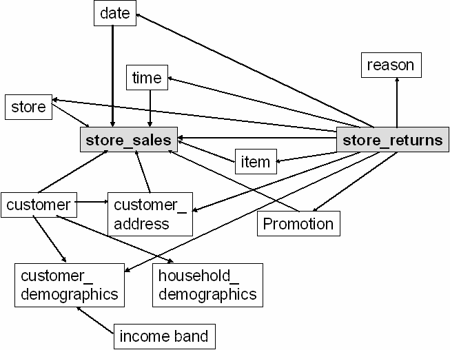
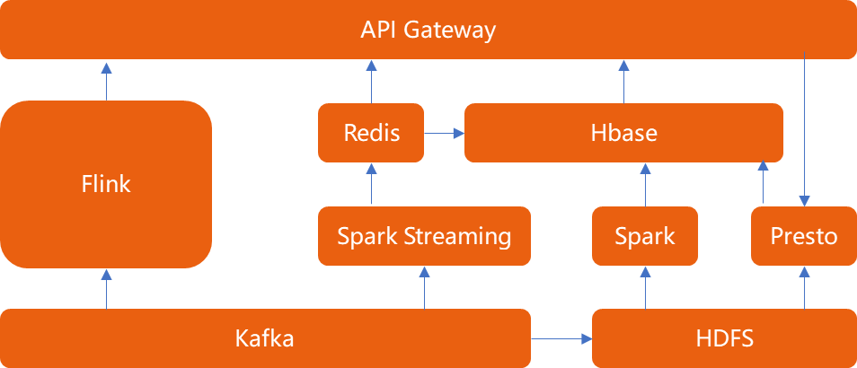

# 一、毕业设计——题目一：分析一条 TPCDS SQL

分析一条 TPCDS SQL（请基于 Spark 3.1.1 版本解答）

1、运行该 SQL，如 q38，并截图该 SQL 的 SQL 执行图
2、该 SQL 用到了哪些优化规则（optimizer rules）
3、请各用不少于 200 字描述其中的两条优化规则
4、SQL 从中任意选择一条：
    https://github.com/apache/spark/tree/master/sql/core/src/test/resources/tpcds

## TPC-DS简介
TPC-DS是一套决策支持系统测试基准，主要针对零售行业。提供99个SQL查询（SQL99或2003），分析数据量大，
测试数据与实际商业数据高度相似，同时具有各种业务模型（分析报告型，数据挖掘型等等）。
TPC-DS 测试集采用星型和雪花型等多维数据模型，包含7张事实表和17张维度表，
以store channel为例，事实表和维度表的关联关系如下所示：

详细可参考  [常用测试模型：TPCDS](https://bbs.huaweicloud.com/blogs/198087)

## 1、运行q1
    SQL释义：查找退回商品的次数比某一年某一特定州，某一商店的平均退货次数多20%以上的客户。   

    SQL原文：
     WITH customer_total_return AS
    ( SELECT
            sr_customer_sk AS ctr_customer_sk,
            sr_store_sk AS ctr_store_sk,
            sum(sr_return_amt) AS ctr_total_return
        FROM store_returns, date_dim
        WHERE sr_returned_date_sk = d_date_sk AND d_year = 2000
        GROUP BY sr_customer_sk, sr_store_sk)
    SELECT c_customer_id
    FROM customer_total_return ctr1, store, customer
    WHERE ctr1.ctr_total_return >
        (SELECT avg(ctr_total_return) * 1.2
        FROM customer_total_return ctr2
        WHERE ctr1.ctr_store_sk = ctr2.ctr_store_sk)
        AND s_store_sk = ctr1.ctr_store_sk
        AND s_state = 'TN'
        AND ctr1.ctr_customer_sk = c_customer_sk
    ORDER BY c_customer_id
    LIMIT 100

## 2、优化规则

### 规则1：使用表的别名
    在From语句中分别对customer_total_return表采用表别名ctr1、ctl2。

    使用表别名的好处在于：
    1、	缩短SQL长度，让SQL便于阅读和理解，本SQL表别名既用于From子句，也用于Where子句；
    2、	当在SQL语句中连接多个表时，使用表的别名并把别名前缀于每个列名上。
        这样就可以减少解析的时间并减少那些由列名歧义引起的语法错误；
    3、	本SQL对customer_total_return表使用了两个别名，是因为在不同的Select子句中都需要用到同一张表，
        避免歧义性，防止SQL引擎报错，特设置两个表别名。ctl2表用于过滤查询条件数据，减少数据过滤计算量。
 
### 规则2：使用WITH AS
    在语句开始利用WITH AS创建了一个表customer_total_return，这个表为临时表。
    本质上是把后面要重复用到SQL语句（SQL片段）放在了WITH AS，并起了一个别名，在后面的查询就可以用它，
    既可以提高SQL语句的可读性，对于大批量的SQL语句还可以起到一个优化的作用。

    优化的价值在于降低表链接查询的成本，本SQL中，WITH AS所定义的customer_total_return被调用两次以上，
    SQL优化器会自动将WITH AS短语所获取的数据放入一个temp表里，这样可以极大提高查询速度。同理，如果只被调用一次，
    则不会创建temp表，对提高查询速度没有帮助，只会提高SQL可读性。

# 二、毕业设计——题目二：架构设计题 

你是某互联网公司的大数据平台架构师，请设计一套基于 Lambda 架构的数据平台架构，
要求尽可能多的把课程中涉及的组件添加到该架构图中。并描述 Lambda 架构的优缺点，要求不少于 300 字。

## 1、对照Lambda架构，用Kafka作为消息中间件，用Hive、Presto进行批处理，用Spark、Flink进行实时处理
   

## 2、架构说明
    数据从Kafka出来后，走两条路线。
    
    一条线向上走Spark Streaming和Flink:
    实时数据处理：Spark Streaming，实现秒级实时数据处理，计算结果同步到Redis，并批量转存到HBase。
    准实时数据处理：Flink，处理分钟级&小时级数据，直接供业务使用。
    
    一条线向右走ETL进HDFS：
    当实时数据处理出问题时，Spark调取HDFS数据进行某一时间区间的数据全量重算，并同步数据到HBase，
    保持实时数据与离线数据的一致。

## 3、优缺点说明

### 优点
    主要是稳定。
    对于实时计算部分的计算成本可控，批量处理可以用晚上的时间来整体批量计算，这样把实时计算和离线计算高峰分开。

### 缺点
    主要是成本。
    1、应用成本：实时与批量计算结果不一致引起的数据口径问题，因为批量和实时计算走的是两个计算框架和计算程序，
    算出的结果往往不同，经常看到一个数字当天看是一个数据，第二天看昨天的数据反而发生了变化。
    2、计算成本：批量计算在计算窗口内无法完成，在IoT时代，数据量级越来越大，经常发现夜间只有4、5个小时的时间窗口，
    已经无法完成白天20多个小时累计的数据，保证早上上班前准时出数据已成为每个大数据团队头疼的问题。
    3、开发成本：数据源变化都要重新开发，开发周期长，每次数据源的格式变化，业务的逻辑变化都需要针对ETL和Streaming做开发修改，
    整体开发周期很长，业务反应不够迅速。
    4、存储成本：服务器存储大，数据仓库的典型设计，会产生大量的中间结果表，造成数据急速膨胀，加大服务器存储压力。