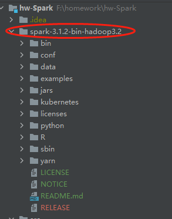
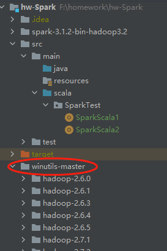
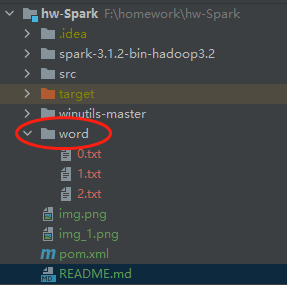
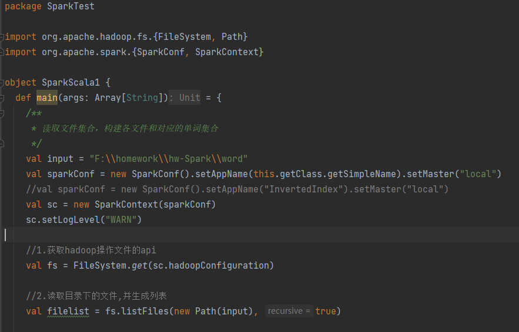
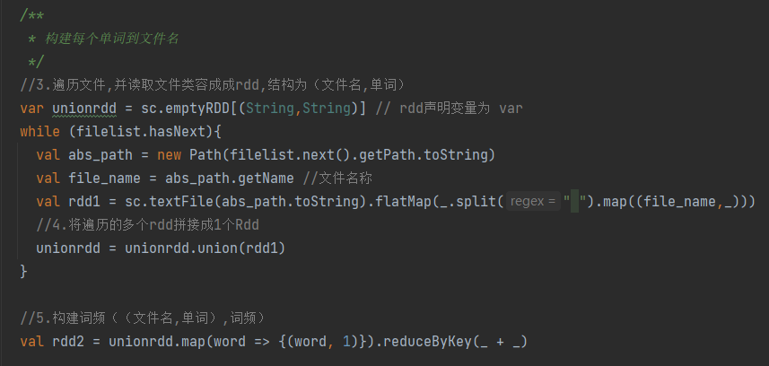
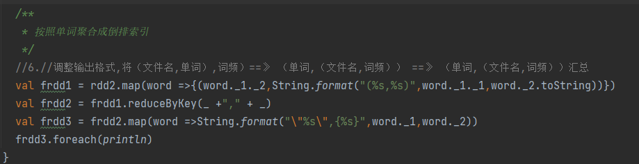
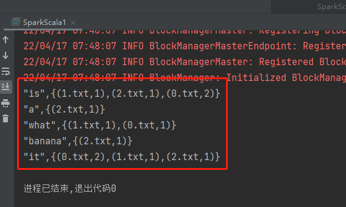
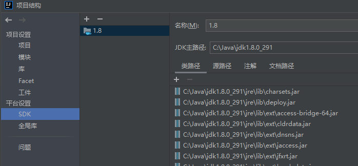
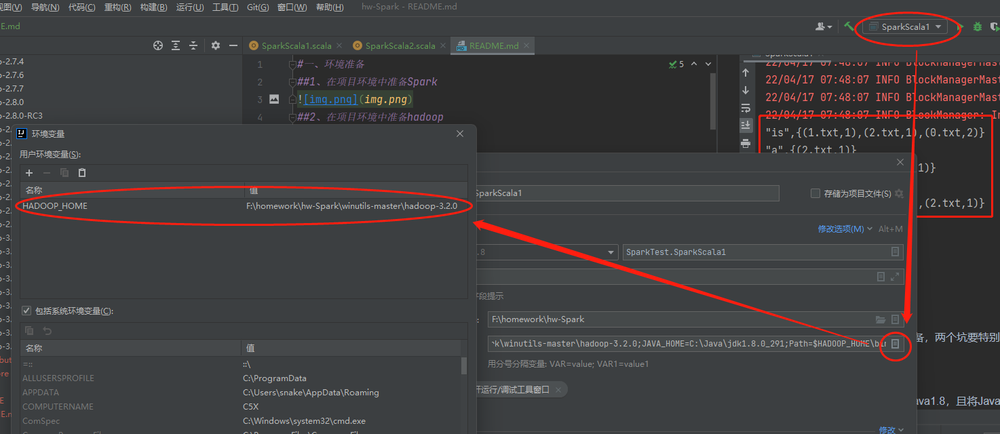

#一、环境准备

##1、在项目环境中准备Spark

##2、在项目环境中准备hadoop

##3、在项目环境中准备基础数据

#二、作业一：使用 RDD API 实现带词频的倒排索引

##1、代码位置

\hw-Spark\src\main\scala\SparkTest\SparkScala1

##2、本地执行，输出倒排索引

##3、代码调试

调试过程中，最大的坑在于环境的准备，两个坑要特别小心：

###①JDK环境

IDEA默认JDK为Java17，要调整为Java1.8，且将Java放到一个没有空格的目录中

###②hapdoop环境

由于下的spark包是hadoop3.2的，在winutils-master中要选择hadoop-3.2.0

#三、作业二：Distcp 的 Spark 实现

##1、代码位置

\hw-Spark\src\main\scala\SparkTest\SparkScala2

##2、本地执行

学业不精，仍未掌握技术要领，程序尚不能有效执行。

##3、代码调试

努力调试中……