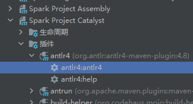

# 一、作业原题 ： 实现 Compact table command

## 1. 要求：
添加 compact table 命令，用于合并小文件，例如表 test1 总共有 50000 个文件，每个 1MB，通过该命令，合成为 500 个文件，每个约 100MB。

## 2. 语法：
COMPACT TABLE table_identify [partitionSpec] [INTO fileNum FILES]；

## 3.说明：
基本要求是完成以下功能：COMPACT TABLE test1 INTO 500 FILES；
如果添加 partitionSpec，则只合并指定的 partition 目录的文件；
如果不加 into fileNum files，则把表中的文件合并成 128MB 大小。

# 二、解题思路

## 1、整体与“SHOW VERSION"的作业思路一致：
①修改SqlBase.g4文件：在statement、ansiNonResvered、nonReserved、keyword list四个节内添加相关命令
②执行Maven里的anltr4
③修改SparkSqlParser.scala文件，添加相关方法    
④修改commands.scala文件
⑤重新编译Spark
⑥执行小文件

## 2、修改SqlBase.g4文件（\spark-3.2.1\sql\catalyst\src\main\antlr4\org\apache\spark\sql\catalyst\parser\SqlBase.g4）

### statement
| COMPACT TABLE target=tableIdentifier partitionSpec?
(INTO fileNum=INTEGER_VALUE identifier)? #compactTable

### ansiNonResvered
| FILES

### nonReserved
| FILES

### keyword list
FILES: 'FILES';

## 3、执行Maven里的anltr4:anltr4

## 4、修改SparkSqlParser.scala文件（\spark-3.2.1\sql\core\src\main\scala\org\apache\spark\sql\execution\SparkSqlParser.scala）, 重写visitCompactTable方法
    override def visitCompactTable(ctx: CompactTableContext): LogicalPlan = withOrigin(ctx) {
        val table: TableIdentifier = visitTableIdentifier(ctx.tableIdentifier())
        val fileNum: Option[Int] = ctx.INTEGER_VALUE().getText.toInt
        CompactTableCommand(table, fileNum)
    }

## 5、在 commands.scala（\hw-SparkSQL\spark-3.2.1\sql\core\src\main\scala\org\apache\spark\sql\execution\command\commands.scala） 类中增加实现类 CompactTableCommand
    case class CompactTableCommand(table: TableIdentifier,fileNum: Option[Int]) extends LeafRunnableCommand {
        override def output: Seq[Attribute] = Seq(AttributeReference("no_return", StringType, false)())
                
        override def run(spark: SparkSession): Seq[Row] = {
            val dataDF: DataFrame = spark.table(table)
            val num: Int = fileNum match {
                case Some(i) => i
                case _ =>
                (spark
                .sessionState
                .executePlan(dataDF.queryExecution.logical)
                .optimizedPlan
                .stats.sizeInBytes / (1024L * 1024L * 128L)
                ).toInt
            }

            log.warn(s"fileNum is $num")
            val tmpTableName = table.identifier+"_tmp"
            dataDF.write.mode(SaveMode.Overwrite).saveAsTable(tmpTableName)
            spark.table(tmpTableName).repartition(num).write.mode(SaveMode.Overwrite).saveAsTable(table.identifier)
            spark.sql(s"drop table if exists $tmpTableName")
            log.warn("Compacte Table Completed.")
            Seq()
        }
    }

## 5、在 spark 源码根目录下执行命令
    ./build/sbt clean package -Phive -Phive-thriftserver -DskipTests

## 6、将 SPARK_HOME 环境变量设置成 spark 源码根目录，然后执行./bin/spark-sql，进入 spark-sql 控制台之后，执行相关命令
