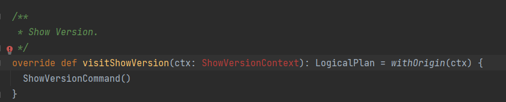

# 第一题，为 Spark SQL 添加一条自定义命令
@SHOW VERSION
@显示当前 Spark 版本和 Java 版本

## 1、修改SqlBase.g4文件（\hw-SparkSQL\spark-3.2.1\sql\catalyst\src\main\antlr4\org\apache\spark\sql\catalyst\parser\SqlBase.g4）

## 2、执行Maven里的anltr4:anltr4

## 3、修改SparkSqlParser.scala文件（\hw-SparkSQL\spark-3.2.1\sql\core\src\main\scala\org\apache\spark\sql\execution\SparkSqlParser.scala）, 重写visitShowVersion方法

## 4、在 commands.scala（\hw-SparkSQL\spark-3.2.1\sql\core\src\main\scala\org\apache\spark\sql\execution\command\commands.scala） 类中增加实现类 ShowVersionCommand

## 5、在 spark 源码根目录下执行命令

./build/sbt package -DskipTests -Phive -Phive-thriftserver

## 6、将 SPARK_HOME 环境变量设置成 spark 源码根目录，然后执行./bin/spark-sql，进入 spark-sql 控制台之后，执行 show version 命令

# 作业二：构建 SQL 满足如下要求

通过 set spark.sql.planChangeLog.level=WARN，查看：

## 1、构建一条 SQL，同时 apply 下面三条优化规则：
CombineFilters
CollapseProject
BooleanSimplification

### ①CombineFilters规则
CombineFilters是谓词下推的三个规则之一，是合并Filter节点的优化器，即处理Filter+Filter的情况，
与谓词下推的另外两个规则PushPredicateThroughJoin、PushPredicateThroughNonJoin搭配使用。

### ②CollapseProject规则
CollapseProject主要是对select操作（对应Project逻辑计划）进行合并，

### ③BooleanSimplification规则
BooleanSimplification提前短路可以短路的布尔表达式

### ④SQL语句
    select a.address
    from (
        select name, address, age 
        from customers 
        where 1="1" and age > 5    
    ) a
    where a.age<30

## 2、构建一条 SQL，同时 apply 下面五条优化规则：
ConstantFolding
PushDownPredicates
ReplaceDistinctWithAggregate
ReplaceExceptWithAntiJoin
FoldablePropagation

### ①ConstantFolding规则
ConstantFolding是常数合并，将常量的计算合并起来。
例如: C = A+B,其中A和B都是constant,比如 A= 2,B =3,则在使用C时,直接使用C =5,而不是使用C =2+3。

### ②PushDownPredicates规则
PushDownPredicates谓词下推， 顾名思义，就是把过滤算子（就是你在 sql语句里面写的 where语句），尽可能地放在执行计划靠前的地方，
好处就是尽早地过滤到不必要的数据，后续流程都节省了计算量，从而优化了性能。

### ③ReplaceDistinctWithAggregate规则
ReplaceDistinctWithAggregate将distinct转换为Aggregate语句，将Select distinct转换为Groupby，
执行算子（集合类型的操作算子）的替换操作，避免进行重复的逻辑转换。

### ④ReplaceExceptWithAntiJoin规则
ReplaceExceptWithAntiJoin将Except算子替换为Left-Anti Join算子，
执行算子（集合类型的操作算子）的替换操作，避免进行重复的逻辑转换。

### ⑤FoldablePropagation规则

### ⑥SQL 语句

    (select a.address , a.age + (100 + 80) , Now() z
    from (
        select distinct name, age , address  
        from customers
    ) a
    where a.age>10 order by z)
    except
    (select a.address , a.age + (100 + 80), Now() z
    from (
        select distinct name, age , address  
        from customers
    ) a
    where a.name="saya");

# 作业三：实现自定义优化规则（静默规则）

## 第一步：实现自定义规则 (静默规则，通过 set spark.sql.planChangeLog.level=WARN，确认执行到就行)

    case class MyPushDown(spark: SparkSession) extends Rule[LogicalPlan] {
        logWarning( msg = "MultiplyOptimizationRule Start")

        def apply(plan: LogicalPlan): LogicalPlan = plan transform {
            case Multiply(left, right, failOnError) if right.isInstanceOf[Literal]
                && right.asInstanceOf[Literal].value.asInstanceOf[Int] == 1 => left
            case Multiply(left, right, failOnError) if left.isInstanceOf[Literal]
                && left.asInstanceOf[Literal].value.asInstanceOf[Int] == 1 => right
        }
    }

## 第二步：创建自己的 Extension 并注入

    class MySparkSessionExtension extends (SparkSessionExtensions => Unit) {
        override def apply(extensions: SparkSessionExtensions): Unit = {
        extensions.injectOptimizerRule { session =>
            new MyPushDown(session)
            }
        }
    }

### 第三步：通过 spark.sql.extensions 提交
    
    bin/spark-sql --jars my.jar --conf spark.sql.extensions=com.jikeshijian.MySparkSessionExtension