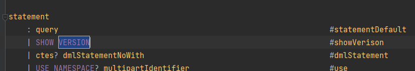
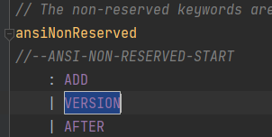
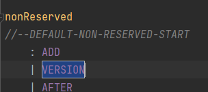
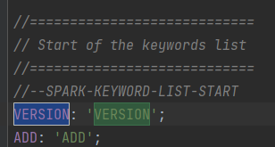
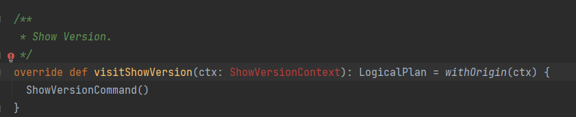
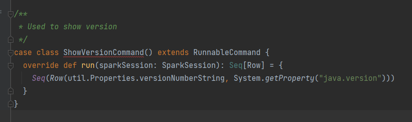

# 第一题，为 Spark SQL 添加一条自定义命令
@SHOW VERSION
@显示当前 Spark 版本和 Java 版本

## 1、修改SqlBase.g4文件（\hw-SparkSQL\spark-3.2.1\sql\catalyst\src\main\antlr4\org\apache\spark\sql\catalyst\parser\SqlBase.g4）

## 2、执行Maven里的anltr4:anltr4

##3、修改SparkSqlParser.scala文件（\hw-SparkSQL\spark-3.2.1\sql\core\src\main\scala\org\apache\spark\sql\execution\SparkSqlParser.scala）, 重写visitShowVersion方法

##4、在 commands.scala（\hw-SparkSQL\spark-3.2.1\sql\core\src\main\scala\org\apache\spark\sql\execution\command\commands.scala） 类中增加实现类 ShowVersionCommand

##5、在 spark 源码根目录下执行命令

./build/sbt package -DskipTests -Phive -Phive-thriftserver

##6、将 SPARK_HOME 环境变量设置成 spark 源码根目录，然后执行./bin/spark-sql，进入 spark-sql 控制台之后，执行 show version 命令